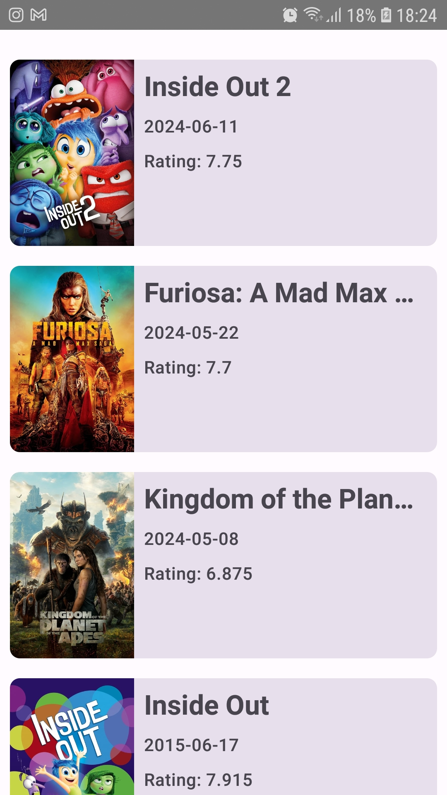
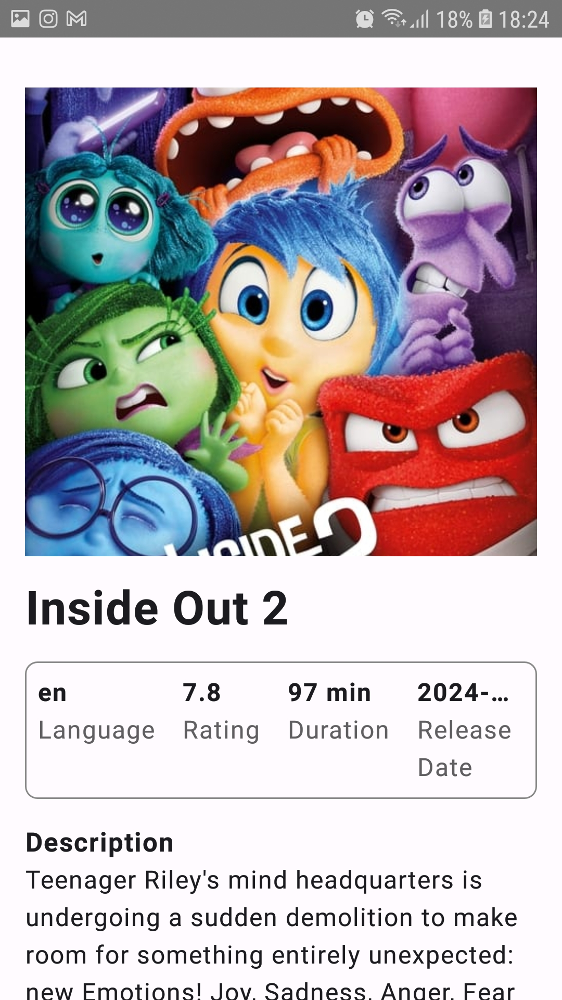

# Movie MVVM App
Movie World is an Android application that allows users to browse a list of trending movies and view detailed information about each movie. The app is built using Kotlin, Jetpack Compose, and follows modern Android development best practices.

## Features

- Trending Movies List: View a list of trending movies fetched from The Movie Database (TMDb) API.
- Movie Details: View detailed information about a selected movie, including title, release date, genres, rating, and more.

## Screenshots

# Home Page

# Detail Page

## Architecture
The app follows the MVVM (Model-View-ViewModel) architecture pattern, which helps in separating the business logic from the UI. This ensures a clean, maintainable, and testable codebase.

## Tech Stack
- Kotlin: The programming language used.
- Jetpack Compose: Modern toolkit for building native Android UI.
- ViewModel: Part of Android Architecture Components to manage UI-related data.
- LiveData: Lifecycle-aware data holder used for observing data changes.
- Retrofit: Type-safe HTTP client for Android and Java.
- Coil: Image loading library for Android.
